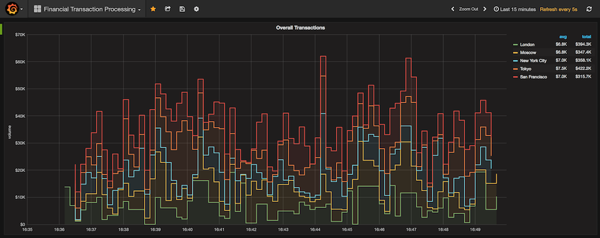

# Fast Data: Financial Transaction Processing

Note that a DC/OS 1.8.7+ cluster and the DC/OS CLI 0.14+ installed locally are the prerequisites for the following.

This repo should be available locally (use: `git clone https://github.com/dcos/demos.git`)
and going forward we'll call the directory it resides in `$DEMO_HOME`.

Services and libraries used in this demo:

- Apache Kafka 0.10.0 with Shopify's [sarama](https://godoc.org/github.com/Shopify/sarama) package, client-side.
- InfluxDB 0.13.0 with [influxdata v2](https://github.com/influxdata/influxdb/tree/master/client/v2) package, client-side.
- Grafana v3.1.1

## Preparation

Before running the demo, here are a few things you have to set up.

### OPTIONAL: For local development

For local development we use [DC/OS tunneling](https://dcos.io/docs/1.8/administration/access-node/tunnel/) to make the nodes directly accessible on the development machine:

```bash
$ sudo dcos tunnel vpn --client=/Applications/Tunnelblick.app/Contents/Resources/openvpn/openvpn-2.3.12/openvpn
Password:
*** Unknown ssh-rsa host key for 35.156.70.254: 13ec7cde1d3967d2371eb375f48c4690

ATTENTION: IF DNS DOESN'T WORK, add these DNS servers!
198.51.100.1
198.51.100.2
198.51.100.3

Waiting for VPN server in container 'openvpn-6nps1efm' to come up...

VPN server output at /tmp/tmpn34d7n0d
VPN client output at /tmp/tmpw6aq3v4z
```

Note that it may be necessary to [add the announced DNS servers]( https://support.apple.com/kb/PH18499?locale=en_US) as told by Tunnelblick, and make sure they are the first in the list.

### InfluxDB

Install InfluxDB with the following [options](influx-ingest/influx-config.json):

```bash
$ cd $DEMO_HOME/1.8/fintrans/influx-ingest/
$ dcos package install --options=influx-config.json influxdb
```

### Grafana

Install Marathon-LB and Grafana (the latter uses the former):

```bash
$ dcos package install marathon-lb
$ dcos package install grafana

```

The Grafana dashboard is available on `$PUBLIC_AGENT_IP:13000`, and if you don't know `$PUBLIC_AGENT_IP` yet, [find it out first](https://dcos.io/docs/1.8/administration/locate-public-agent/). Log in with: `admin`/`admin`.

Next, we set up a datasource, connecting Grafana to InfluxDB. Use `http://influxdb.marathon.l4lb.thisdcos.directory:8086` as the URL under `Http settings` with `root`/`root` as credential and `fintrans` as the value for `Database` under `InfluxDB Details`. The result should look as follows:


### Kafka

[Install](https://github.com/dcos/examples/tree/master/1.8/kafka) the Apache Kafka package with the following [options](kafka-config.json):

```bash
$ cd $DEMO_HOME/1.8/fintrans/
$ dcos package install kafka --options=kafka-config.json
```

Next, figure out where the broker is:

```bash
$ dcos kafka connection

{
  "address": [
    "10.0.3.178:9398"
  ],
  "zookeeper": "master.mesos:2181/dcos-service-kafka",
  "dns": [
    "broker-0.kafka.mesos:9398"
  ],
  "vip": "broker.kafka.l4lb.thisdcos.directory:9092"
}
```

## Producing transactions

With the VPN tunnel enabled, we can run the fintrans generator:

```bash
$ cd $DEMO_HOME/1.8/fintrans/generator/
$ go build
$ ./generator --broker broker-0.kafka.mesos:9398
INFO[0001] &sarama.ProducerMessage{Topic:"London", Key:sarama.Encoder(nil), Value:"678 816 2957", Metadata:interface {}(nil), Offset:10, Partition:0, Timestamp:time.Time{sec:0, nsec:0, loc:(*time.Location)(nil)}, retries:0, flags:0}
INFO[0003] &sarama.ProducerMessage{Topic:"SF", Key:sarama.Encoder(nil), Value:"762 543 6395", Metadata:interface {}(nil), Offset:4, Partition:0, Timestamp:time.Time{sec:0, nsec:0, loc:(*time.Location)(nil)}, retries:0, flags:0}
INFO[0005] &sarama.ProducerMessage{Topic:"London", Key:sarama.Encoder(nil), Value:"680 840 8115", Metadata:interface {}(nil), Offset:11, Partition:0, Timestamp:time.Time{sec:0, nsec:0, loc:(*time.Location)(nil)}, retries:0, flags:0}
INFO[0007] &sarama.ProducerMessage{Topic:"SF", Key:sarama.Encoder(nil), Value:"363 101 9878", Metadata:interface {}(nil), Offset:5, Partition:0, Timestamp:time.Time{sec:0, nsec:0, loc:(*time.Location)(nil)}, retries:0, flags:0}
INFO[0009] &sarama.ProducerMessage{Topic:"SF", Key:sarama.Encoder(nil), Value:"302 505 5777", Metadata:interface {}(nil), Offset:6, Partition:0, Timestamp:time.Time{sec:0, nsec:0, loc:(*time.Location)(nil)}, retries:0, flags:0}
INFO[0011] &sarama.ProducerMessage{Topic:"London", Key:sarama.Encoder(nil), Value:"848 948 2683", Metadata:interface {}(nil), Offset:12, Partition:0, Timestamp:time.Time{sec:0, nsec:0, loc:(*time.Location)(nil)}, retries:0, flags:0}
INFO[0013] &sarama.ProducerMessage{Topic:"NYC", Key:sarama.Encoder(nil), Value:"611 695 5484", Metadata:interface {}(nil), Offset:9, Partition:0, Timestamp:time.Time{sec:0, nsec:0, loc:(*time.Location)(nil)}, retries:0, flags:0}
INFO[0015] &sarama.ProducerMessage{Topic:"NYC", Key:sarama.Encoder(nil), Value:"396 465 6789", Metadata:interface {}(nil), Offset:10, Partition:0, Timestamp:time.Time{sec:0, nsec:0, loc:(*time.Location)(nil)}, retries:0, flags:0}
INFO[0018] &sarama.ProducerMessage{Topic:"Moscow", Key:sarama.Encoder(nil), Value:"132 570 3197", Metadata:interface {}(nil), Offset:9, Partition:0, Timestamp:time.Time{sec:0, nsec:0, loc:(*time.Location)(nil)}, retries:0, flags:0}
INFO[0020] &sarama.ProducerMessage{Topic:"NYC", Key:sarama.Encoder(nil), Value:"607 672 9732", Metadata:interface {}(nil), Offset:11, Partition:0, Timestamp:time.Time{sec:0, nsec:0, loc:(*time.Location)(nil)}, retries:0, flags:0}
^C
```

## Consuming transactions

One consumer is the InfluxDB ingestion process that uses Grafana as the visual frontend. Again, assuming VPN tunnel is enabled, you need to find out the InfluxDB API URL and provide it via an environment variable `INFLUX_API` (note that this is only for local development necessary, not in prod):

```bash
$ cd $DEMO_HOME/1.8/fintrans/influx-ingest/
$ go build
$ INFLUX_API=http://10.0.3.178:11973 ./influx-ingest --broker broker-0.kafka.mesos:9398
INFO[0003] Got main.Transaction{City:"Tokyo", Source:"836", Target:"378", Amount:1211}  func=consume
INFO[0003] Connected to &client.client{url:url.URL{Scheme:"http", Opaque:"", User:(*url.Userinfo)(nil), Host:"10.0.3.178:11973", Path:"", RawPath:"", RawQuery:"", Fragment:""}, username:"root", password:"root", useragent:"InfluxDBClient", httpClient:(*http.Client)(0xc82000bb30), transport:(*http.Transport)(0xc8200d00c0)}  func=consume
INFO[0003] Preparing batch &client.batchpoints{points:[]*client.Point(nil), database:"fintrans", precision:"s", retentionPolicy:"", writeConsistency:""}  func=consume
INFO[0003] Added point &client.Point{pt:(*models.point)(0xc8200839e0)}  func=consume
INFO[0003] Ingested &client.batchpoints{points:[]*client.Point{(*client.Point)(0xc82000f9f0)}, database:"fintrans", precision:"s", retentionPolicy:"", writeConsistency:""}  func=ingest2Influx
INFO[0005] Got main.Transaction{City:"London", Source:"597", Target:"378", Amount:7394}  func=consume
INFO[0005] Connected to &client.client{url:url.URL{Scheme:"http", Opaque:"", User:(*url.Userinfo)(nil), Host:"10.0.3.178:11973", Path:"", RawPath:"", RawQuery:"", Fragment:""}, username:"root", password:"root", useragent:"InfluxDBClient", httpClient:(*http.Client)(0xc8202c2d20), transport:(*http.Transport)(0xc82021a300)}  func=consume
INFO[0005] Preparing batch &client.batchpoints{points:[]*client.Point(nil), database:"fintrans", precision:"s", retentionPolicy:"", writeConsistency:""}  func=consume
INFO[0005] Added point &client.Point{pt:(*models.point)(0xc820206b40)}  func=consume
INFO[0005] Ingested &client.batchpoints{points:[]*client.Point{(*client.Point)(0xc8200e5010)}, database:"fintrans", precision:"s", retentionPolicy:"", writeConsistency:""}  func=ingest2Influx
```

In Grafana at `$PUBLIC_AGENT_IP:13000`, after loading the [dashboard](influx-ingest/grafana-dashboard.json), you should see something like this:



Alternatively you can consume the messages manually like so:

```bash
$ dcos node ssh --master-proxy --leader
...
core@ip-10-0-6-69 ~ $ docker run -it mesosphere/kafka-client
...
root@e7c989566a22:/bin# ./kafka-console-consumer.sh --zookeeper leader.mesos:2181/dcos-service-kafka --topic NYC --from-beginning
611 695 5484
396 465 6789
607 672 9732
^CProcessed a total of 3 messages
```

As a result, consuming a specific topic (`NYC` in the above case) you should see something like above until you hit `CTRL+C`: the wire format of the messages is:

```
source_account target_account amount
```

So, for example, the following:

```
396 465 6789
```

… means that USD `6789` have been transferred from account no `396` to `465`.

Note 1: if you want to consume all topics at once you can use `./kafka-console-consumer.sh --zookeeper leader.mesos:2181/dcos-service-kafka --whitelist London,NYC,SF,Moscow,Tokyo`.

Note 2: if you want to reset the topics, do a `dcos kafka topic list` and `dcos kafka topic delete XXX` with `XXX` being one of the listed topics.


