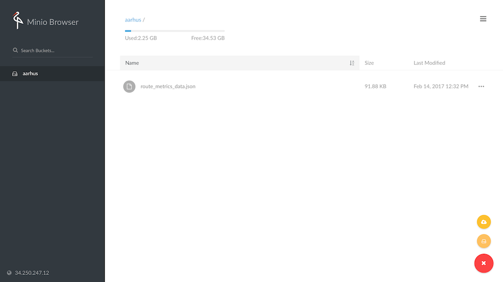

# Fast Data: Sensor Analytics

This demo is all about gaining insights from sensor streaming data.


- Estimated time for completion:
 - Single command: 10min
 - Manual: 25min
 - Development: unbounded
- Target audience: Anyone interested stream data processing and analytics with Apache Spark.

**Table of Contents**:

- [Architecture](#architecture)
- [Prerequisites](#prerequisites)
- Install the demo:
 - [Single command](#single-command)
 - [Manual](#manual)
- [Use](#use) the demo
- [Development and testing](#development)

## Architecture


In this demo, we're using the Open Data Aarhus [real-time traffic  data](https://www.odaa.dk/dataset/realtids-trafikdata) kindly provided by the Aarhus Kommune (Denmark, Europe), available via the CC Open Data license. Open Data rocks!

The traffic fetcher pulls live data from the real-time data source and ingests it into Kafka.
The mapping agent joins the data with a static dataset (the Route and Metrics data) served via Minio and
serves both the static content (OSM map) and the actual data points.

## Prerequisites

- A running [DC/OS 1.8.7](https://dcos.io/releases/1.8.7/) or higher cluster with at least 4 private agents and 1 public agent each with 2 CPUs and 5 GB of RAM available as well as the [DC/OS CLI](https://dcos.io/docs/1.8/usage/cli/install/) installed in version 0.14 or higher.
- The [dcos/demo](https://github.com/dcos/demos/) Git repo must be available locally, use: `git clone https://github.com/dcos/demos.git` if you haven't done so, yet.
- The JSON query util [jq](https://github.com/stedolan/jq/wiki/Installation) must be installed.
- [SSH](https://dcos.io/docs/1.8/administration/access-node/sshcluster/) cluster access must be set up.

Going forward we'll call the directory you cloned the `dcos/demo` Git repo into `$DEMO_HOME`.

The DC/OS services and support libraries used in the demo are as follows:

- TBD

An [exemplary snapshot](example_data.json) of the traffic real-time data is available here in this repo. This snapshot was created using the following command:

```bash
$ curl -o example_data.json https://www.odaa.dk/api/action/datastore_search?resource_id=b3eeb0ff-c8a8-4824-99d6-e0a3747c8b0d&limit=5
```

Note that the data source is updated roughly every 5 min, something to be taken into account when showing the demo.

## Install

TBD

### Single command

TBD

### Manual

#### Kafka

Install the Apache Kafka package with the following [options](kafka-config.json):

```bash
$ cd $DEMO_HOME/1.8/sensoranalytics/
$ dcos package install kafka --options=kafka-config.json
```

Note that if you are unfamiliar with Kafka and its terminology, you can check out the respective [101 example](https://github.com/dcos/examples/tree/master/1.8/kafka) as well now.

Next, figure out where the broker is:

```bash
$ dcos kafka connection

{
  "address": [
    "10.0.3.178:9398"
  ],
  "zookeeper": "master.mesos:2181/dcos-service-kafka",
  "dns": [
    "broker-0.kafka.mesos:9398"
  ],
  "vip": "broker.kafka.l4lb.thisdcos.directory:9092"
}
```

Note the FQDN for the broker, in our case `broker-0.kafka.mesos:9398`.

### Minio

To serve some static data we use Minio in this demo, just as you would use, say S3 in AWS.

In order to use Minio you first need to have Marathon-LB installed:

```bash
$ dcos package install marathon-lb
```

Next find out the [IP of the public agent](https://dcos.io/docs/1.8/administration/locate-public-agent/)
and store it in an environment variable called `$PUBLIC_AGENT_IP`, for example:

```bash
$ export PUBLIC_AGENT_IP=34.250.247.12
```

Now you can install the Minio package like so:

```bash
$ cd $DEMO_HOME/1.8/sensoranalytics/
$ sed -i '.tmp' "s/PUBLIC_AGENT_IP/$PUBLIC_AGENT_IP/" ./minio-config.json
$ dcos package install minio --options=minio-config.json
$ mv ./minio-config.json.tmp ./minio-config.json
```

After this, Minio is available on port 80 of the public agent, so open `$PUBLIC_AGENT_IP`
in your browser and you should see the UI. Note that you can learn how to obtain the
`AccessKey` and `SecretKey` via the DC/OS Minio [tutorial](https://github.com/dcos/examples/tree/master/1.8/minio#using-browser-console).

Next, you upload the static route and metrics data set into Minio: create a bucket called `aarhus` and upload [route_metrics_data.json](route_metrics_data.json) there, resulting in something like the following:



Now we're all set and can use the demo.

### Services

install:

## Use

The following sections describe how to use the demo after having installed it.

As a result, this is what you should see in the mapping agent Web interface:


## Development

If you are interested in testing this demo locally or want to extend it, follow the instructions in this section.


### Tunneling

For local development and testing we use [DC/OS tunneling](https://dcos.io/docs/1.8/administration/access-node/tunnel/) to make the nodes directly accessible on the development machine. The following instructions are only an example (using Tunnelblick on macOS) and the concrete steps necessary depend on your platform as well as on what VPN client you're using.

```bash
$ sudo dcos tunnel vpn --client=/Applications/Tunnelblick.app/Contents/Resources/openvpn/openvpn-2.3.12/openvpn
```

Note that it is necessary to [add the announced DNS servers]( https://support.apple.com/kb/PH18499?locale=en_US) as told by Tunnelblick, and make sure the are they appear at the top of the list, before any other DNS server entries.

### Traffic data fetcher

For a local dev/test setup, and with [DC/OS VPN tunnel](#tunneling) enabled, we can run the traffic data fetcher as follows:

```bash
$ cd $DEMO_HOME/1.8/sensoranalytics/traffic-fetcher/
$ go build
$ ./traffic-fetcher -broker broker-0.kafka.mesos:9233
INFO[0002] &sarama.ProducerMessage{Topic:"trafficdata", Key:sarama.Encoder(nil), Value:"{\"result\":{\"fields\":[{\"type\":\"int4\",\"id\":\"_id\"},{\"type\":\"int4\",\"id\":\"REPORT_ID\"},{\"type\":\"timestamp\",\"id\":\"TIMESTAMP\"},{\"type\":\"text\",\"id\":\"status\"},{\"type\":\"int4\",\"id\":\"avgMeasuredTime\"},{\"type\":\"int4\",\"id\":\"medianMeasuredTime\"},{\"type\":\"int4\",\"id\":\"vehicleCount\"},{\"type\":\"int4\",\"id\":\"avgSpeed\"}],\"records\":[{\"status\":\"OK\",\"avgMeasuredTime\":104,\"TIMESTAMP\":\"2017-01-13T11:50:00\",\"medianMeasuredTime\":104,\"avgSpeed\":19,\"vehicleCount\":9,\"_id\":418,\"REPORT_ID\":204273},{\"status\":\"OK\",\"avgMeasuredTime\":59,\"TIMESTAMP\":\"2017-01-13T11:50:00\",\"medianMeasuredTime\":59,\"avgSpeed\":35,\"vehicleCount\":6,\"_id\":53,\"REPORT_ID\":187748},{\"status\":\"OK\",\"avgMeasuredTime\":138,\"TIMESTAMP\":\"2017-01-13T11:50:00\",\"medianMeasuredTime\":138,\"avgSpeed\":30,\"vehicleCount\":11,\"_id\":228,\"REPORT_ID\":183091},{\"status\":\"OK\",\"avgMeasuredTime\":69,\"TIMESTAMP\":\"2017-01-13T11:54:00\",\"medianMeasuredTime\":69,\"avgSpeed\":48,\"vehicleCount\":8,\"_id\":330,\"REPORT_ID\":181331},{\"status\":\"OK\",\"avgMeasuredTime\":120,\"TIMESTAMP\":\"2017-01-13T11:55:00\",\"medianMeasuredTime\":120,\"avgSpeed\":61,\"vehicleCount\":5,\"_id\":338,\"REPORT_ID\":197951},{\"status\":\"OK\",\"avgMeasuredTime\":145,\"TIMESTAMP\":\"2017-01-13T11:55:00\",\"medianMeasuredTime\":145,\"avgSpeed\":51,\"vehicleCount\":3,\"_id\":345,\"REPORT_ID\":158505},{\"status\":\"OK\",\"avgMeasuredTime\":57,\"TIMESTAMP\":\"2017-01-13T11:55:00\",\"medianMeasuredTime\":57,\"avgSpeed\":70,\"vehicleCount\":6,\"_id\":395,\"REPORT_ID\":197463},{\"status\":\"OK\",\"avgMeasuredTime\":78,\"TIMESTAMP\":\"2016-10-05T09:29:00\",\"medianMeasuredTime\":78,\"avgSpeed\":67,\"vehicleCount\":17,\"_id\":450,\"REPORT_ID\":1164},{\"status\":\"OK\",\"avgMeasuredTime\":44,\"TIMESTAMP\":\"2017-01-13T11:50:00\",\"medianMeasuredTime\":44,\"avgSpeed\":39,\"vehicleCount\":20,\"_id\":381,\"REPORT_ID\":183009},{\"status\":\"OK\",\"avgMeasuredTime\":188,\"TIMESTAMP\":\"2017-01-13T11:50:00\",\"medianMeasuredTime\":188,\"avgSpeed\":15,\"vehicleCount\":2,\"_id\":49,\"REPORT_ID\":187509}]}}\n", Metadata:interface {}(nil), Offset:8, Partition:0, Timestamp:time.Time{sec:0, nsec:0, loc:(*time.Location)(nil)}, retries:0, flags:0}
```

To check if the messages arrive in the `trafficdata` topic in Kafka, you can, for example, ssh into the Master and then do the following there (see also the [DC/OS Kafka example](https://github.com/dcos/examples/tree/master/1.8/kafka#consume-a-message) if you're unsure about what's happening here):

```bash
core@ip-10-0-5-169 ~ $ docker run -it mesosphere/kafka-client
root@a773778c0962:/bin# ./kafka-console-consumer.sh --zookeeper leader.mesos:2181/dcos-service-kafka --topic trafficdata --from-beginning
{"result":{"fields":[{"type":"int4","id":"_id"},{"type":"int4","id":"REPORT_ID"},{"type":"timestamp","id":"TIMESTAMP"},{"type":"text","id":"status"},{"type":"int4","id":"avgMeasuredTime"},{"type":"int4","id":"medianMeasuredTime"},{"type":"int4","id":"vehicleCount"},{"type":"int4","id":"avgSpeed"}],"records":[{"status":"OK","avgMeasuredTime":104,"TIMESTAMP":"2017-01-13T11:50:00","medianMeasuredTime":104,"avgSpeed":19,"vehicleCount":9,"_id":418,"REPORT_ID":204273},{"status":"OK","avgMeasuredTime":59,"TIMESTAMP":"2017-01-13T11:50:00","medianMeasuredTime":59,"avgSpeed":35,"vehicleCount":6,"_id":53,"REPORT_ID":187748},{"status":"OK","avgMeasuredTime":138,"TIMESTAMP":"2017-01-13T11:50:00","medianMeasuredTime":138,"avgSpeed":30,"vehicleCount":11,"_id":228,"REPORT_ID":183091},{"status":"OK","avgMeasuredTime":69,"TIMESTAMP":"2017-01-13T11:54:00","medianMeasuredTime":69,"avgSpeed":48,"vehicleCount":8,"_id":330,"REPORT_ID":181331},{"status":"OK","avgMeasuredTime":120,"TIMESTAMP":"2017-01-13T11:55:00","medianMeasuredTime":120,"avgSpeed":61,"vehicleCount":5,"_id":338,"REPORT_ID":197951},{"status":"OK","avgMeasuredTime":145,"TIMESTAMP":"2017-01-13T11:55:00","medianMeasuredTime":145,"avgSpeed":51,"vehicleCount":3,"_id":345,"REPORT_ID":158505},{"status":"OK","avgMeasuredTime":57,"TIMESTAMP":"2017-01-13T11:55:00","medianMeasuredTime":57,"avgSpeed":70,"vehicleCount":6,"_id":395,"REPORT_ID":197463},{"status":"OK","avgMeasuredTime":78,"TIMESTAMP":"2016-10-05T09:29:00","medianMeasuredTime":78,"avgSpeed":67,"vehicleCount":17,"_id":450,"REPORT_ID":1164},{"status":"OK","avgMeasuredTime":44,"TIMESTAMP":"2017-01-13T11:50:00","medianMeasuredTime":44,"avgSpeed":39,"vehicleCount":20,"_id":381,"REPORT_ID":183009},{"status":"OK","avgMeasuredTime":188,"TIMESTAMP":"2017-01-13T11:50:00","medianMeasuredTime":188,"avgSpeed":15,"vehicleCount":2,"_id":49,"REPORT_ID":187509}]}}
```


### Consumption

The mapping agent uses [OSM map overlay](http://harrywood.co.uk/maps/examples/openlayers/marker-popups.view.html).

To launch the mapping agent:

```bash
$ cd $DEMO_HOME/1.8/sensoranalytics/mapping-agent
$ go build
$ PUBLIC_AGENT_IP=34.250.247.12 ACCESS_KEY_ID=F3QE89J9WPSC49CMKCCG SECRET_ACCESS_KEY=2/parG/rllluCLMgHeJggJfY9Pje4Go8VqOWEqI9 ./mapping-agent -broker broker-0.kafka.mesos:9517
```


## Discussion

Should you have any questions or suggestions concerning the demo, please raise an [issue](https://dcosjira.atlassian.net/) in Jira or let us know via the [users@dcos.io](mailto:users@dcos.io) mailing list.
