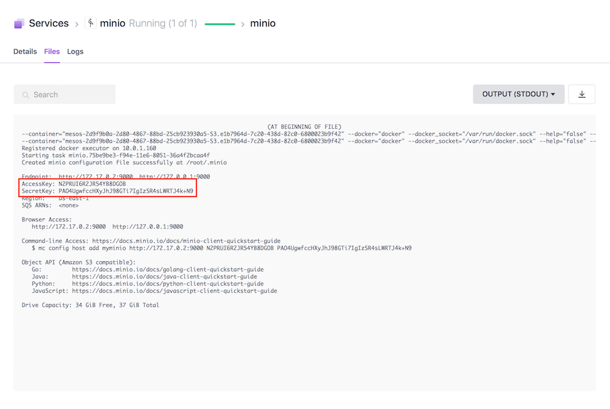
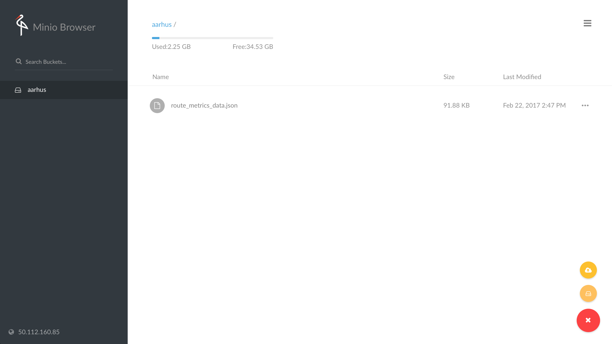
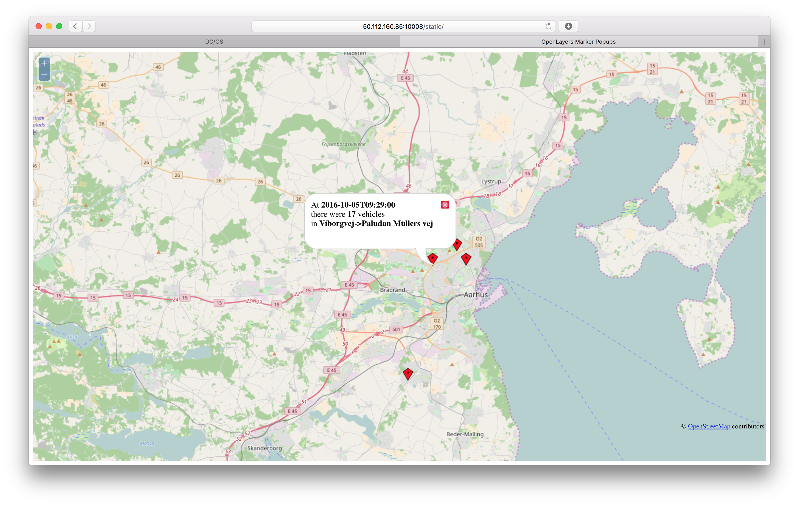

# Fast Data: Sensor Analytics

This demo is all about gaining insights from sensor streaming data in the context of traffic data.
As a real-time data source we're using the Open Data Aarhus [traffic  data](https://www.odaa.dk/dataset/realtids-trafikdata),
kindly provided by the Aarhus Kommune (Denmark, Europe), which is available via the CC Open Data license. Open Data rocks!

The demo shows how to ingest the real-time data, join it with a static dataset containing metadata
about the sensors and finally shows the rendering of the tracked vehicles on a map.

- Estimated time for completion:
 - Install: 20min
 - Development: unbounded
- Target audience: Anyone interested in stream data processing.

**Table of Contents**:

- [Architecture](#architecture)
- [Prerequisites](#prerequisites)
- [Install](#install) the demo
- [Use](#use) the demo
- [Development and testing](#development)

## Architecture


The traffic fetcher pulls live data from the real-time data source and ingests it into Kafka.
The mapping agent joins the data with a static dataset (the route and metrics data) served via Minio and
serves both the static content (OSM map) and the actual data points.

## Prerequisites

- A running [DC/OS 1.9.0](https://dcos.io/releases/1.9.0/) or higher cluster with at least 4 private agents and 1 public agent each with 2 CPUs and 5 GB of RAM available as well as the [DC/OS CLI](https://dcos.io/docs/1.9/usage/cli/install/) installed in version 0.14 or higher.
- The [dcos/demo](https://github.com/dcos/demos/) Git repo must be available locally, use: `git clone https://github.com/dcos/demos.git` if you haven't done so, yet.
- The JSON query util [jq](https://github.com/stedolan/jq/wiki/Installation) must be installed.
- [SSH](https://dcos.io/docs/1.9/administration/access-node/sshcluster/) cluster access must be set up.

Going forward we'll call the directory you cloned the `dcos/demo` Git repo into `$DEMO_HOME`.

The DC/OS services and support libraries used in the demo are as follows:

- Apache Kafka 0.10.0 with Shopify's [sarama](https://godoc.org/github.com/Shopify/sarama) package, client-side.
- Minio with the [Minio Go Library for Amazon S3 compatible cloud storage](https://github.com/minio/minio-go) package, client-side.

An [exemplary snapshot](example_data.json) of the traffic real-time data is available here in this repo. This snapshot was created using the following command:

```bash
$ curl -o example_data.json https://www.odaa.dk/api/action/datastore_search?resource_id=b3eeb0ff-c8a8-4824-99d6-e0a3747c8b0d&limit=5
```

Note that the data source is updated roughly every 5 min, something to be taken into account when using the demo.

## Install

### Kafka

Install the Apache Kafka package with the following [options](kafka-config.json):

```bash
$ cd $DEMO_HOME/1.9/sensoranalytics/
$ dcos package install kafka --options=kafka-config.json
```

Note that if you are unfamiliar with Kafka and its terminology, you can check out the respective [101 example](https://github.com/dcos/examples/tree/master/1.8/kafka) as well now.

### Minio

To serve some static data we use Minio in this demo, just as you would use, say, S3 in AWS.

In order to use Minio you first need to have Marathon-LB installed:

```bash
$ dcos package install marathon-lb
```

Next find out the [IP of the public agent](https://dcos.io/docs/1.9/administration/locate-public-agent/)
and store it in an environment variable called `$PUBLIC_AGENT_IP`, for example:

```bash
$ export PUBLIC_AGENT_IP=50.112.160.85
```

Now you can install the Minio package like so:

```bash
$ cd $DEMO_HOME/1.9/sensoranalytics/
$ ./install-minio.sh
```

After this, Minio is available on port 80 of the public agent, so open `$PUBLIC_AGENT_IP`
in your browser and you should see the UI.

Next, we will need to get the Minio credentials in order to access the Web UI (and later on the HTTP API).
The credentials used by Minio are akin to the ones you might know from Amazon S3, called `$ACCESS_KEY_ID`
and `$SECRET_ACCESS_KEY`. In order to obtain these credentials, first go to the `Services` tab of the DC/OS UI and
select the running Minio service. Select the running instance (`minio.75be9be3-f94e-11e6-8051-36a4f2bcaa4f` in my case),
click on the `Files` tab, and select the `stdout` file to view it (by clicking on the magnifying glass icon):


Then you should see the output with the credentials:



Note that you can learn more about Minio and the credentials in the respective [example](https://github.com/dcos/examples/tree/master/1.8/minio#using-browser-console).

Next, you upload the static route and metrics data set into Minio:

1. create a bucket called `aarhus`
1. upload the JSON file [route_metrics_data.json](route_metrics_data.json) into this bucket

The result should look something like the following:



Now that we've set up the data services we can move on to the stateless custom services that
interact with the stream data source and take care of the play-out, respectively.

### Custom services

The two stateless custom services, written in Go, are the traffic fetcher and the
mapping agent, deployed as Marathon services.

A prerequisite for the install script to work is that three environment variables
are defined: `$PUBLIC_AGENT_IP` (the public agent IP address), as well as `$ACCESS_KEY_ID`
and `$SECRET_ACCESS_KEY` (Minio credentials); all of which are explained in the
previous section. I've been using the following (specific for my setup):

```bash
$ export PUBLIC_AGENT_IP=50.112.160.85
$ export ACCESS_KEY_ID=N2PRUI6R2JR54YB8DGOB
$ export SECRET_ACCESS_KEY=PAO4UgwfccHXyJhJ98GTi7IgIzSR4sLWRTJ4k+N9
```

Now you can install the custom services like so:

```bash
$ cd $DEMO_HOME/1.9/sensoranalytics/
$ ./install-services.sh
deploying the traffic fetcher ...
Created deployment ad47233d-ce8a-4f5f-a596-1b1d93398bf4
==========================================================================
deploying the mapping agent ...
Created deployment 90d4fa7c-8045-43da-97ad-6162dcdc6a03
DONE ====================================================================
```

Now you're done setting up the demo and can move on to the fun part: using it.

## Use

The following sections describe how to use the demo after having installed it.

Simply go to `http://$PUBLIC_AGENT_IP:10008/static/` and as a result you should see the mapping agent Web interface:



## Development

If you are interested in testing this demo locally or want to extend it, follow the instructions in this section.

### Tunneling

For local development and testing we use [DC/OS tunneling](https://dcos.io/docs/1.9/administration/access-node/tunnel/) to make the nodes directly accessible on the development machine. The following instructions are only an example (using Tunnelblick on macOS) and the concrete steps necessary depend on your platform as well as on what VPN client you're using.

```bash
$ sudo dcos tunnel vpn --client=/Applications/Tunnelblick.app/Contents/Resources/openvpn/openvpn-2.3.12/openvpn
```

Note that it is necessary to [add the announced DNS servers]( https://support.apple.com/kb/PH18499?locale=en_US) as told by Tunnelblick, and make sure the are they appear at the top of the list, before any other DNS server entries.

### Kafka connection

Both the traffic data fetcher and the mapping agent need to know how to connect to Kafka.
For that, figure out where the broker is:

```bash
$ dcos kafka connection

{
  "address": [
    "10.0.0.135:9531"
  ],
  "zookeeper": "master.mesos:2181/dcos-service-kafka",
  "dns": [
    "broker-0.kafka.mesos:9531"
  ],
  "vip": "broker.kafka.l4lb.thisdcos.directory:9092"
}
```

Note the FQDN for the broker, in our case `broker-0.kafka.mesos:9398`, you'll need it for the following sections.

### Traffic data fetcher

For a local dev/test setup, and with [DC/OS VPN tunnel](#tunneling) enabled, we can run the traffic data fetcher as follows:

```bash
$ cd $DEMO_HOME/1.9/sensoranalytics/traffic-fetcher/
$ go build
$ ./traffic-fetcher -broker broker-0.kafka.mesos:9233
```

### Mapping agent

The mapping agent consumes data from Kafka and takes care of the play-out, that is, the rendering of the markers (representing vehicle tracking stations equipped with sensors) on an OpenStreetMap overlay map:

- on startup the mapping agent consumes the route and metrics data from Minio
- it serves the marker data as JSON via the `/data` endpoint
- it uses [OSM map overlay](http://harrywood.co.uk/maps/examples/openlayers/marker-popups.view.html) to visualize traffic data via the `/static` endpoint

To launch the mapping agent locally, with [DC/OS VPN tunnel](#tunneling) enabled, do the following (note that you need to expose the env variables):

```bash
$ cd $DEMO_HOME/1.9/sensoranalytics/mapping-agent
$ go build
$ PUBLIC_AGENT_IP=34.250.247.12 ACCESS_KEY_ID=F3QE89J9WPSC49CMKCCG SECRET_ACCESS_KEY=2/parG/rllluCLMgHeJggJfY9Pje4Go8VqOWEqI9 ./mapping-agent -broker broker-0.kafka.mesos:9517
```

Now you can open `http://localhost:8080` in your browser and you should see the OSM map with the markers. Allow a few seconds until you see data arriving from Kafka before the markers are properly rendering.

## Discussion

In this demo we ingested real-time traffic data into Kafka, joined it with a static dataset from Minio and
displayed the resulting car tracking on a map.

- One can argue that the static (metadata) can be simply packaged along with the mapping agent rather than going via Minio.
While this is technically correct, the point of the exercise was to show how streaming data and static data can be joined
in a loosely coupled and flexible manner. In general, for anything you'd use in a public cloud setup S3, Azure Storage and the like,
you can use Minio on DC/OS.
- Besides monitoring, this architecture and setup is production-ready. Kafka takes care of the scaling issues around data capturing and ingestion and via the System Marathon (`Services` tab in the DC/OS UI) the traffic fetcher and the mapping agent can be scaled. Further, the System Marathon makes sure that should any of the stateless services fail it will be re-started, acting as a distributed supervisor for these long-running tasks.
- The mapping agent only implements a simple interface, effectively rendering the markers that represent traffic capturing stations.  Interesting extensions of the mapping agent would be to allow for a more interactivity, alerts based on traffic volume, as well as different visualizations and/or summaries.

Should you have any questions or suggestions concerning the demo, please raise an [issue](https://jira.mesosphere.com/) in Jira or let us know via the [users@dcos.io](mailto:users@dcos.io) mailing list.
